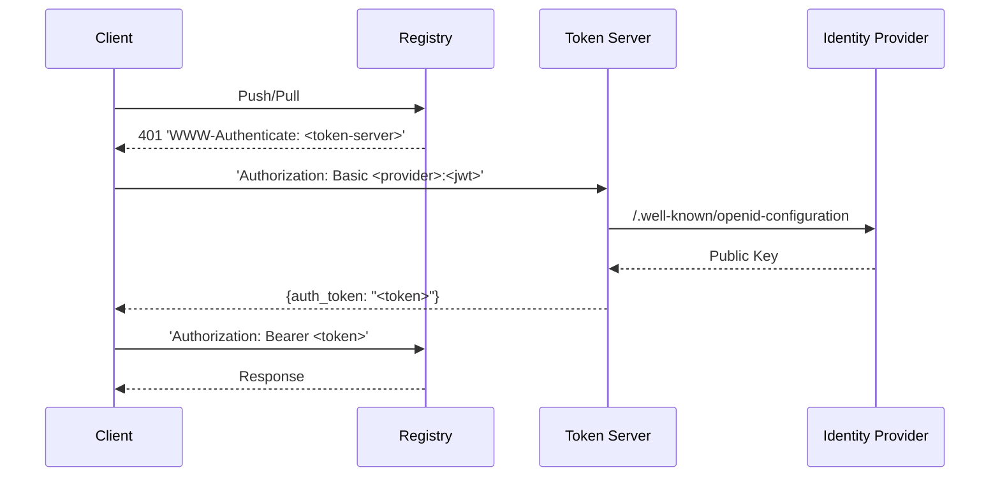
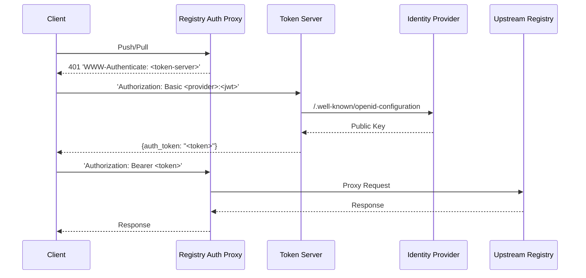

# jwt-registry-auth

A solution that leverages JWT tokens to enable transparent and passwordless
container registry authentication and authorization for machine workloads like
Kubernetes pods and Github Actions.

This is a proof of concept and is not suitable for production use cases.

## Goals

There are two main aims here.

1. Allow Kubernetes pods and other types of 'machine' workload to pull/push
   images from a registry without having to define static secrets.
2. Enable authorization based on the properties of the workload's identity. For
   example, allow Kubernetes service accounts within a given namespace to pull
   from a particular set of repositories.

## Solution

The goals are accomplished by enabling clients to authenticate to container
registries with a JWT token issued by a trusted identity provider.

This PoC provides implementations that enable the solution. These
implementations can be split into two categories (server and client) which are
expanded on in the following sections.

## Server

The container registry server must be capable of accepting a JWT token as a
client's credentials, validating the token with a trusted identity provider and
performing authorization based on the claims in the token.

As far as I know, the only container registry that currently supports anything
like this is 
[Chainguard's registry](https://edu.chainguard.dev/chainguard/chainguard-registry/authenticating/#authenticating-with-github-actions).

In lieu of native registry support, this PoC implements two methods of strapping
JWT authentication and authorization onto an existing registry.

### Token Server

The [Distribution registry](https://github.com/distribution/distribution)
supports configurable authentication and authorization via a pluggable 'token'
server.

The [`cmd/token-server`](cmd/token-server) application implements a token server
which:

1. Accepts a JWT token as a user's password
2. Validates and authenticates the token with a trusted identity provider
3. Applies authorization based on the token's claims via CEL policies

### Registry Auth Proxy

Most registries don't support pluggable authentication and authorization in the
same way that the Distribution registry does.

For these registries, the PoC provides a reverse proxy,
[`cmd/registry-auth-proxy`](cmd/registry-auth-proxy) that sits in front of a
registry and performs token-based authentication before proxying requests to
the upstream registry.

## Client

Clients that push or pull images from the registry must be configured so that
they can fetch a token from their identity provider and then provide that as
their password when authenticating with the registry.

There are numerous ways to do this depending on the type of client and where it
is running.

This PoC provides two methods, which are outlined below.

### Kubernetes Controller

The [`cmd/kube-controller`](cmd/kube-controller) application runs in the cluster
and enables Kubernetes pods to push and pull images based on their service 
account identity.

Refer to the [README.md](cmd/kube-controller/README.md) for more information.

### Github Actions

The [`actions/docker-login`](actions/docker-login) GitHub Action logs into a
container registry with a GitHub Actions issued JWT token as the password.

Refer to the [README.md](actions/docker-login/README.md) for more information.
