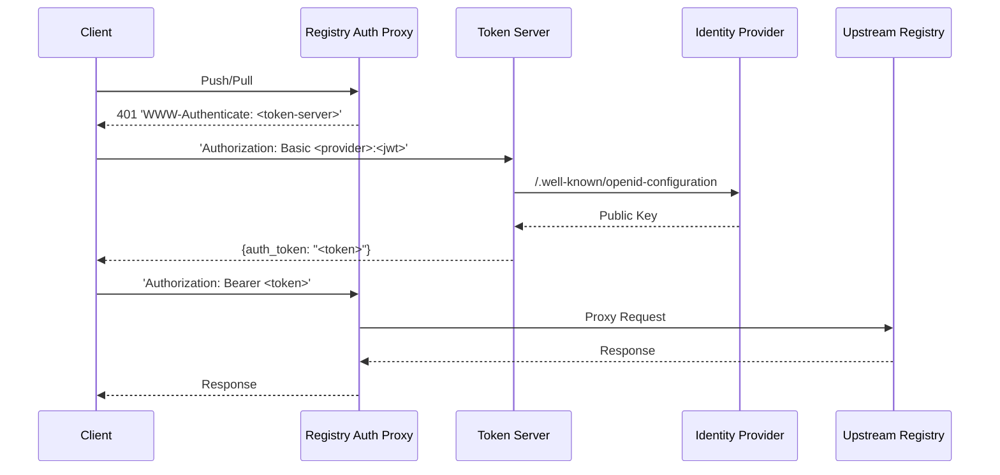

# registry-auth-proxy



This is a reverse proxy that sits in front of a container registry and offloads
authentication and authorization to an external service as described by 
[this specification](https://github.com/distribution/distribution/blob/main/docs/spec/auth/token.md).

It supports any auth server that is compatible with the [distribution
registry's `token` auth implementation](https://docs.docker.com/registry/configuration/#token),
including [`docker_auth`](https://github.com/cesanta/docker_auth) and
[`token-server`](../token-server).

This can be useful for providing authentication for an unsecured registry, or
supporting an authentication method not provided by the upstream registry.

## Configuration

```
./registry-auth-proxy \
  gcr.io \
  --token-realm=https://registry-proxy.example.com/token \
  --token-issuer=https://registry-proxy.example.com \
  --token-service=registry-proxy.example.com \
  --token-root-cert-bundle=/etc/tls/ca.crt
```

The first and only argument to `registry-auth-proxy` should be the host of the
registry you want to proxy to.

The proxy supports the same set of options as the [`token` auth method in the
distribution registry](https://docs.docker.com/registry/configuration/#token),
provided as flags with the prefix `--token-`.

Authentication credentials for the upstream registry will be taken from the
[`$DOCKER_CONFIG/config.json`](https://docs.docker.com/engine/reference/commandline/login/)
local to the proxy.

The proxy also supports retrieving credentials from the environment in the same
manner as a cloud provider credential helper.
[See here for more details](https://github.com/google/go-containerregistry/tree/main/pkg/authn#emulating-cloud-provider-credential-helpers).
