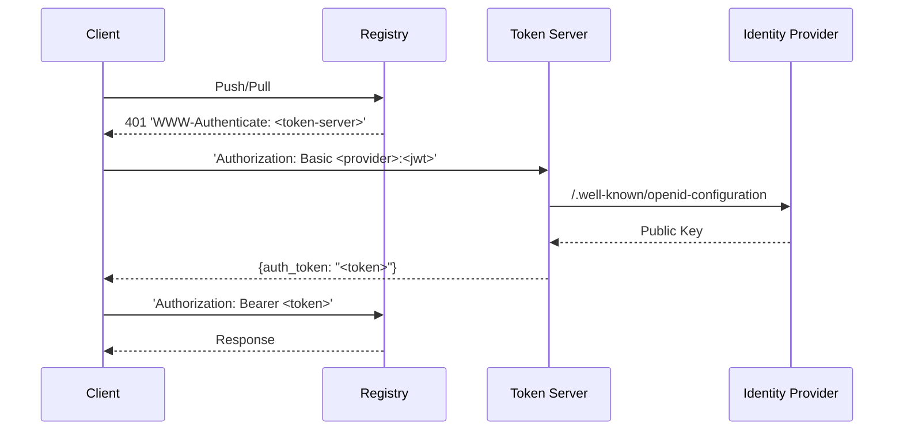

# token-server



This server makes it possible to authenticate to a container registry with a JWT
token.

It implements the protocol described
[here](https://github.com/distribution/distribution/blob/main/docs/spec/auth/token.md)
and is compatible with both the [Open Source distribution
registry](https://github.com/distribution/distribution) and
[`registry-auth-proxy`](../registry-auth-proxy).

When combined with [`registry-auth-proxy`](../cmd/registry-auth-proxy) this
service allows machine-user workloads like Kubernetes pods and Github Actions
jobs to login based on OIDC Discovery to registries that don't support it.

## Configuration

Supply a configuration file to the server with the `--config-file` flag.

Here's an example of a configuration that allows Github Actions workflows that
run from repositories owned by `foobar` to login as the user `gha` and push to
sub-repositories of `registry.example.com/foobar`. 

For instance, `registry.example.com/foobar/example-repo`.

```yaml
server:
  listenAddress: ":5000"
  tokenPath: "/auth/token"

token:
  issuer: "https://registry.example.com"
  duration: 15m
  certificate: "/etc/tls/tls.crt"
  key: "/etc/tls/tls.key"

providers:
  - name: "gha"
    oidcDiscoveryURL: "https://token.actions.githubusercontent.com"
    authn:
      condition: |
        service == "registry.example.com" &&
        claims["repository_owner"] == "foobar"
    authz:
      condition: |
        scope["action"] == "pull" &&
        scope["type"] == "repository" &&
        scope["name"].startsWith(claims["repository_owner"] + "/")
```

### server

The `server` block configures HTTP server options.

- `listenAddress`: the address the server listens on (default: `:5000`)
- `tokenPath`: the path where tokens are served from (default: `/auth/token`)

```
server:
  listenAddress: ":5000"
  tokenPath: "/auth/token"
```

### token

The `token` block configures the tokens issued by the server.

- `issuer`: The name of the issuer
- `duration`: The duration of the issued tokens (default: `15m`)
- `certificate`: The path to the certificate that signs the token
- `key`: The path to the key that signs the token

```
token:
  issuer: "https://registry.example.com"
  duration: 15m
  certificate: "/etc/tls/tls.crt"
  key: "/etc/tls/tls.key"
```

### providers

The `providers` block is a list of providers. A provider validates JWT tokens
and applies authentication and authorization policies.

You can validate a token with the OIDC Discovery URL.

```
providers:
  - name: "github-actions"
    oidcDiscoveryURL: "https://token.actions.githubusercontent.com"
```

Or, with a list of static keys.

```
providers:
  - name: "kind-cluster"
    staticKeys:
      - key: |
          -----BEGIN PUBLIC KEY-----
          MIIBIjANBgkqhkiG9w0BAQEFAAOCAQ8AMIIBCgKCAQEA4X023dyJGmqXYqDfjOe1
          bB1WrfDmWBY7T+SB1PCdTxtzxHtq6Ws/BWeN3nWetjscmdOtHrzAdpicIyJy+NJ8
          yJsSv8wWrB7gT1oZme84+UFtHAZqDAUm+TV9C2Q4B7BRQ+9GwOyCvTVfoLbEtagt
          GvVLpmrBElzF//mwRBqSzjIbVpAUKYRFBhkx4gYXB47gQd8o5lEX+u2DRzgL7KOt
          CQ6qhJ9HsVLrcTsXYTmRu1evq8EQe9WbDmr40ziRUaUSys+9FgEoN84NVmQja3qt
          1d74MWhNNsXYAku+7Fyk5jimqCfPD+aySCZonVDMq2fD3KgsOP7s/qwIA6ZTPp2b
          ywIDAQAB
          -----END PUBLIC KEY-----
```

#### authn

Configures authentication options.

It has one field: `condition`. This is a Common Expression Language expression
that restricts what otherwise valid authentication credentials issued by the
provider should not be accepted.

The expression must output a boolean representing whether to allow the token to
authenticate.

If the expression evaluates to `false` then the server returns a `401` to the
client.

The following keywords may be referenced in the expression:
- `service`: the name of the service
- `claims`: a map which contains the claims from the JWT

If `condition` is omitted then all validated tokens are allowed.

```
providers:
  - name: "github-actions"
    oidcDiscoveryURL: "https://token.actions.githubusercontent.com"
    authn:
      condition: |
        claims["sub"] == "foobar/example-repo/.github/workflows/build.yml@refs/heads/main"
```

#### authz

Configures authorization options.

It has one field: `condition`. This is a Common Expression Language expression
that defines which scopes a token has permissions for.

Only scopes that are allowed by the condition are included in the tokens issued
by the server.

The following keywords may be referenced in the expression:

- `service`: the name of the service
- `claims`: a map which contains the claims from the JWT
- `scope`: a map which contains the elements of the requested scope:
  - `type`: for instance, `registry` or `repository`
  - `name`: the name of the repository, or `catalog` when `scope["type"] == registry`
  - `action`: for instance, `push`, `pull` and `delete`

```
providers:
  - name: "github-actions"
    oidcDiscoveryURL: "https://token.actions.githubusercontent.com"
    authz:
      condition: |
        scope["action"] == "pull" &&
        scope["type"] == "repository" &&
        scope["name"].startsWith(claims["repository_owner"] + "/")
```
